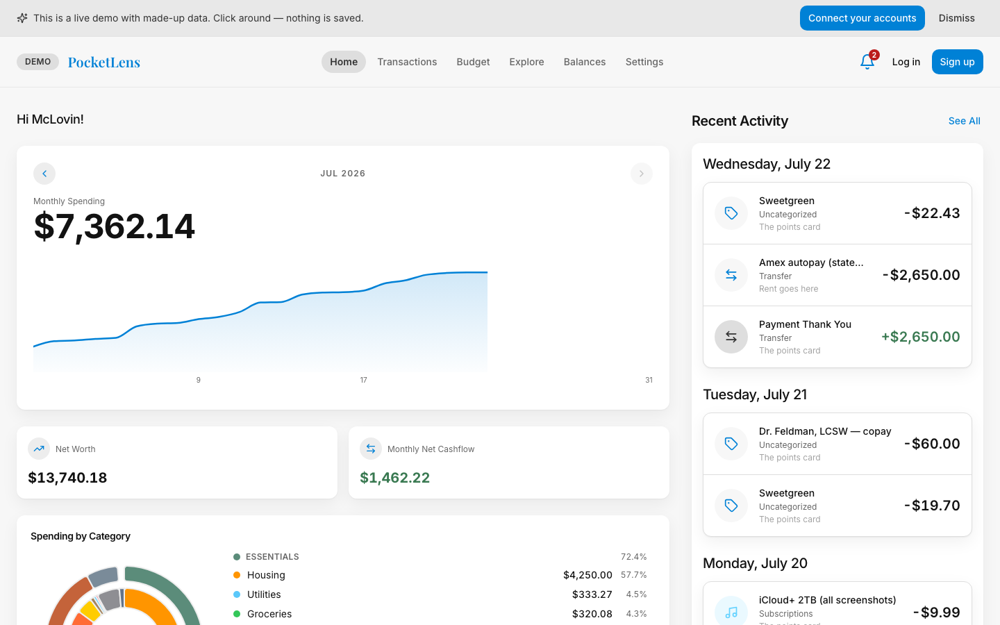
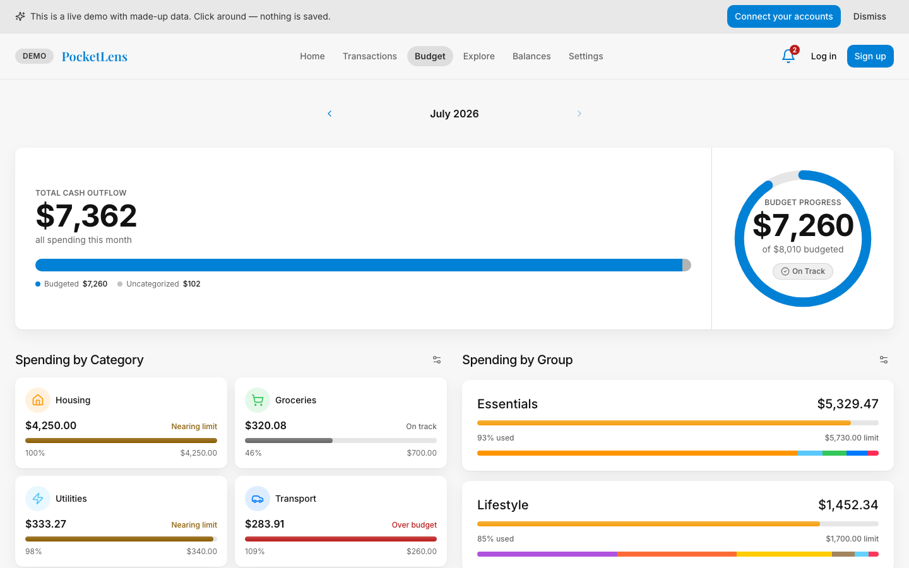

# PocketLens

[](./LICENSE)

PocketLens is a personal finance app you run yourself. It connects to your bank and
brokerage accounts through [Plaid](https://plaid.com) and pulls in transactions, balances,
and holdings automatically. On top of that you get budgets (including zero-based
budgeting), net worth tracking, spending reports, and recurring charge detection.

A few reasons to use it:

- Your data stays in your own Postgres database. No subscription, no ads, nobody else
  reading your transactions.
- It handles multiple users. Each person only sees their own data, and can either use
  their own Plaid account or share the server's.
- Sync is automatic: webhooks for real-time updates, plus a scheduled job that catches
  anything missed. You can export to CSV any time.

The full feature list is in [FEATURES.md](./FEATURES.md).

When you're logged out, the home page runs a live demo on made-up data, so you can try the
whole app before creating an account:





## Stack

There are two pieces: a React + TypeScript web app and a Python (FastAPI) sync service.
Both talk to Supabase (Postgres, auth, and row-level security). The sync service pulls
data from Plaid and writes it to Postgres. The web app reads and writes the database
directly through Supabase's REST API, and only calls the sync service to link a bank or
trigger a sync.

```
┌────────────┐   Plaid SDK    ┌─────────────────────┐   supabase-py    ┌──────────────┐
│   Plaid    │ ─────────────► │  Python sync service │ ───────────────► │   Supabase   │
│  banks +   │                │  (cron + web API)    │                  │  Postgres +  │
│ brokerages │                └─────────────────────┘                  │  Auth + RLS  │
└────────────┘                        ▲                               └──────┬───────┘
                                        │ POST /link, /sync/trigger            │ supabase-js
                                 ┌──────┴───────────────────────────────┐      ▼
                                 │      Browser web app (React/Vite)     │ ◄────┘
                                 └───────────────────────────────────────┘
```

## Requirements

- Supabase, for data storage (see below).
- A [Plaid](https://dashboard.plaid.com/signup) account for bank data. You can set one set
  of credentials for the whole server, let each user add their own in Settings, or both.
- The [Supabase CLI](https://supabase.com/docs/guides/local-development/cli/getting-started) to
  apply the migrations under `finance-backend/supabase/migrations/`.

### Data storage

Your data lives in Postgres, but the app also relies on three other things Supabase
provides: GoTrue for login and password reset, row-level security for keeping each user's
data separate, and PostgREST for the API the web app talks to. All of it is open source,
so you have two options:

1. Self-host Supabase with Docker on your own server. Nothing leaves your machine and you
   don't need an account with anyone. See
   [Supabase self-hosting](https://supabase.com/docs/guides/self-hosting/docker).
2. Use [supabase.com](https://supabase.com). The free tier works, but free projects pause
   after a week of inactivity.

What doesn't work: pointing the app at a plain Postgres server (RDS, Cloud SQL, Neon, a
bare `postgres` container). Login and data access go through the Supabase components, so
without them the app can't run.

## Quickstart (local)

Runs the whole stack on one machine against a local Supabase (Docker), with all migrations
applied.

```bash
git clone <your-fork-url> && cd pocketlens
cd web && npm ci && cd ..                 # install web deps
./scripts/local-dev.sh                    # supabase start + sync-service + vite
```

Open the web app at <http://localhost:5173> (sync-service API runs on `:8000`). Reset local
data with `cd finance-backend && supabase db reset`.

## Production (Docker Compose)

You need a Supabase project (hosted or self-hosted) with the migrations applied. Apply them
from a linked project:

```bash
cd finance-backend
supabase link --project-ref <your-project-ref>   # or --db-url for self-hosted
supabase db push
```

Then configure and run the containers (API + scheduler cron + nginx serving the web build):

```bash
cp finance-backend/sync-service/.env.example finance-backend/sync-service/.env
cp web/.env.example .env    # root .env — Compose reads the VITE_* build args from here
# edit both files (see the env table below)
docker compose up --build
```

Web app comes up on <http://localhost:8080>, API on <http://localhost:8000>.

### Environment variables

Sync service (`finance-backend/sync-service/.env`):

| Variable | Required | What it is |
|---|---|---|
| `SUPABASE_URL` | yes | Supabase project URL. |
| `SUPABASE_SERVICE_ROLE_KEY` | yes | Service-role key. Server-side only — bypasses RLS. |
| `CREDENTIALS_ENC_KEY` | yes | Fernet key encrypting Plaid secrets + access tokens at rest. Must be identical on the API and scheduler; losing it orphans every stored secret. Generate: `python -c "from cryptography.fernet import Fernet; print(Fernet.generate_key().decode())"` |
| `WEB_ORIGINS` | yes | Comma-separated CORS allowlist for the web app, scheme included. The browser's `POST /sync/trigger` fails without it. |
| `PLAID_CLIENT_ID` / `PLAID_SECRET` / `PLAID_ENV` | no | Shared Plaid credentials, used for any user who hasn't added their own. |
| `PLAID_WEBHOOK_URL` | no | Public `…/webhook/plaid` URL for real-time transaction updates. |
| `PLAID_REDIRECT_URI` | no | The API's own `…/link` URL, for OAuth banks (Chase, BofA, …). |
| `PLAID_ITEM_LIMIT` | no | Max active Items per Plaid account (default 10). |
| `FULL_SYNC_COOLDOWN_DAYS` | no | Cooldown between user-triggered full syncs (default 2). |

Web build (root `.env`, baked in at build time — public, no secrets):

| Variable | What it is |
|---|---|
| `VITE_SUPABASE_URL` | Supabase project URL. |
| `VITE_SUPABASE_ANON_KEY` | Supabase anon (publishable) key. |
| `VITE_BACKEND_URL` | Sync-service API URL. |
| `VITE_API_BASE_URL` | Same API URL. |

The scheduler runs three jobs: `sync.py` pulls new data, `reconcile.py` compares against
Plaid's records and fixes anything that drifted, and `digests.py` sends spending digests.
With Docker Compose these run from the cron container. On a hosted deploy there is no
separate scheduler process: the database calls the API on a schedule instead (see
**Scheduled syncs** below).

## Deploy online with Render

The repo ships a `render.yaml` Blueprint declaring two services: the API (web) and the
static web site. Scheduled syncs come from Supabase, not a Render cron (see below).

1. Fork this repo to your own Git host.
2. In Render, **New → Blueprint**, and point it at your fork. Render reads `render.yaml`.
3. Fill in the prompted (`sync: false`) environment variables in the dashboard:
   - **API service** — `SUPABASE_URL`, `SUPABASE_SERVICE_ROLE_KEY`, `CREDENTIALS_ENC_KEY`,
     `WEB_ORIGINS` (set to the web site's public origin), `PLAID_WEBHOOK_URL`,
     `PLAID_REDIRECT_URI`, `TRIGGER_SECRET` (any long random string).
   - **Web site** — `VITE_SUPABASE_URL`, `VITE_SUPABASE_ANON_KEY`, `VITE_BACKEND_URL`,
     `VITE_API_BASE_URL` (the last two set to the API service's URL).
4. You still need a Supabase project. Render hosts the app, not the database.
5. In the Supabase dashboard, add your web app's `…/reset-password` origin under
   **Authentication → URL Configuration → Redirect URLs** so the password-reset link works, and
   configure an SMTP sender so signup-confirmation and reset emails send.

### Scheduled syncs (Supabase pg_cron)

The migration `20260919000000_server_side_scheduler.sql` enables `pg_cron` + `pg_net` and
schedules four jobs that call the API: an hourly incremental sync (`POST /internal/sync`),
a daily reconcile + digests run (`POST /internal/daily`), and two `/health` pings that wake
the free-tier API before each sync and keep it warm during the day. The jobs read the API
URL and the shared secret from Supabase Vault, so run this once in the SQL editor:

```sql
select vault.create_secret('https://your-api.onrender.com', 'pocketlens_api_url');
select vault.create_secret('<the TRIGGER_SECRET value from Render>', 'pocketlens_trigger_secret');
```

Check `cron.job` for the schedule and `cron.job_run_details` for run history. Until both
secrets exist the jobs log a warning and do nothing. The web app also triggers a sync on
sign-in whenever a linked bank hasn't synced in the last hour, so a stalled schedule never
leaves the app stale for longer than a login.

The web app is a plain static build (`web/dist/`), so any static host works too (nginx,
Caddy, Netlify, Cloudflare Pages, S3). Serve it with a SPA fallback to `index.html`. A
working Content-Security-Policy header is in `render.yaml` and `web/nginx.conf`.

## Plaid

There are two ways to set up Plaid credentials, and you can use both at once:

- Per user: each user adds their own Plaid developer account in Settings. The secret is
  validated against Plaid and stored encrypted. Good for multi-user servers, since each
  Plaid account has its own bank connection limit.
- Server-wide: set `PLAID_CLIENT_ID` / `PLAID_SECRET` / `PLAID_ENV` on the sync service
  and every user links through that one account.

Set `PLAID_WEBHOOK_URL` if you want real-time updates; without it the scheduled sync still
keeps data fresh daily. For banks that use OAuth (Chase, Bank of America), set
`PLAID_REDIRECT_URI` and allowlist it in the Plaid dashboard.

## Repository layout

| Path | What |
|---|---|
| `web/` | React + Vite + TypeScript web app |
| `finance-backend/sync-service/` | Python FastAPI API + Plaid sync / reconcile / digest jobs |
| `finance-backend/supabase/migrations/` | Postgres migrations (create every table, view, RPC, and RLS policy; fresh-DB safe) |
| `scripts/` | Local full-stack dev helpers |

Design tokens (the "Terracotta & Sage" system) live in `web/src/index.css` and
`web/tailwind.config.ts`.

## Tests

```bash
cd web && npx tsc -b && npx vitest run          # type-check + unit tests
cd finance-backend/sync-service && pytest -m "not integration"
```

New database features need a migration under `finance-backend/supabase/migrations/` that is
fresh-DB safe and enforces `user_id = auth.uid()` RLS.

## License

Released under the [MIT License](./LICENSE).
</content>
</invoke>
